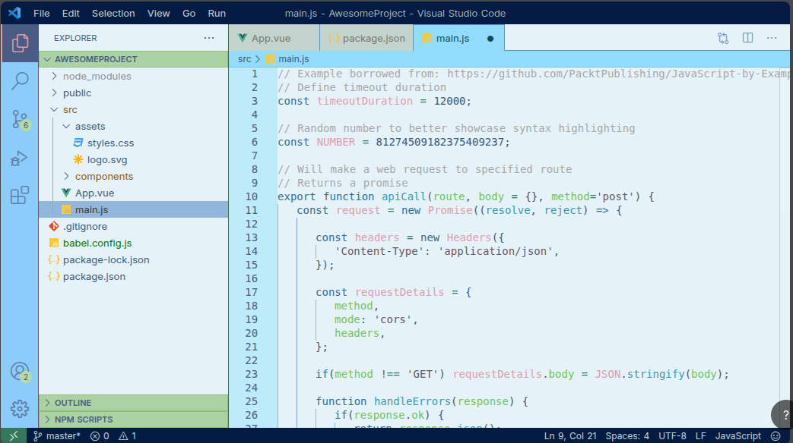

# 🌸 La nobleza de las flores — VS Code Theme

Un tema personalizado para Visual Studio Code inspirado en la paleta de colores del anime **La nobleza de las flores**.

## 🎨 Sobre el proyecto

Este tema fue creado utilizando [Theme Studio](https://themes.vscode.one/) como parte de un proyecto personal para experimentar con la creación y personalización de temas para Visual Studio Code.

## ✨ Características

* 🎨 Paleta de colores inspirada en *La nobleza de las flores*
* 💻 Diseñado para utilizarse en Visual Studio Code
* 🌸 Enfoque visual suave y armonioso
* 🛠️ Creado y personalizado con Theme Studio

## 🚀 Uso

El archivo `noble-bloom-color-theme.json` contiene la configuración del tema generado en Theme Studio.

## 🖼️ Vista previa

## 🛠️ Herramientas

* Visual Studio Code
* Theme Studio
* Git
* GitHub

## 👩‍💻 Autora

**Rocio Peña**

Desarrolladora Backend / Fullstack

* GitHub: [Rocio0209](https://github.com/Rocio0209)
